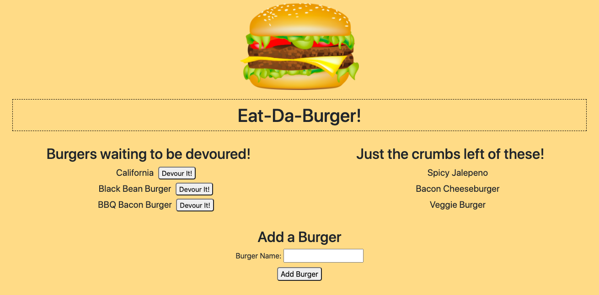

# Eat-Da-Burger!

## About
An app where users can "make" and "eat" burgers, utilizing a MySQL database and RESTful API standards.  Made with MySQL, Handlebars, Express.js, Node.js, jQuery, JavaScript, Bootstrap, CSS, and HTML.

## Usage
To use the app from the command line, run "npm i" to install the required dependencies.  Update config/connection.js with the user's MySQL password, then using schema.sql and seeds.sql in the db directory, create a database.  Run "node server" to start the app connection.  After opening the browser, users can type in the name of a burger and it will save to the left side of the screen along with the other burgers waiting to be eaten.  Beside each uneaten burger is a button to "Devour it!" which will move the burger to the right side of the screen with the other eaten burgers.  Use "control C" in the terminal to end the connection. 
Or follow the link below. 

## Screenshot

## Deployed Link

